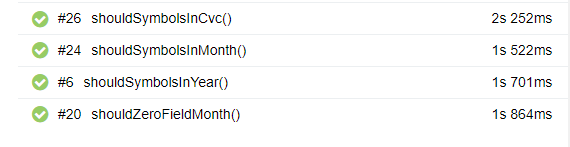
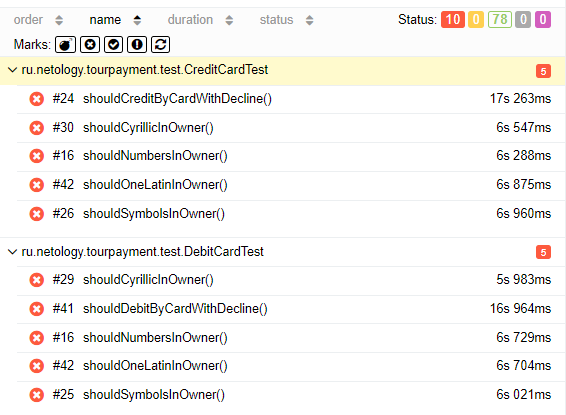

# Отчёт о проведённом тестировании

## 1. Краткое описание

В ходе выполнения дипломной работы было проведено автоматизированное тестирование веб-сервиса "Путешествие дня",
которое представляет собой комплексный сервис, взаимодействующий с СУБД и API Банка.

1. На первом этапе было проведено исследовательское,
   мануальное тестирование и составлен [план автоматизации](https://github.com/Swooow/Diplom/blob/main/Documents/Plan.md);
2. На втором этапе была произведена автоматизация тестовых сценариев;
3. На третьем этапе были составлены отчеты о проведенном тестировании.

## 2. Количество тест-кейсов

- Всего тест-кейсов: 88

- Успешных тестов: 

Дебетовой карты: 39

Кредитной карты: 39

- Проваленных тестов: 10

## 3. Процент успешных/неуспешных тест-кейсов

- Процент успешных: 88.63%
- Процент неуспешных: 11.37%

## 4. Общие рекомендации

1. Устранить [дефекты](https://github.com/Swooow/Diplom/issues);
2. Добавить уникальные идентификаторы для элементов страниц (test-id) для ускорения и упрощения
   автоматизации тестирования;
3. Составить подробную и однозначную документацию к приложению.